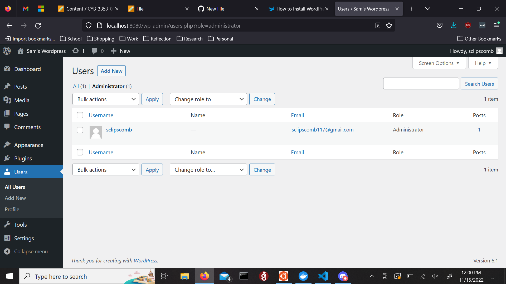

# docker.github.io
# Samuel Lipscomb
# Sys Admin
# 11/15/22
# Documentation and setup for OpenVAS on Docker.

Hello! This is my walkthrough for installing OpenVAS on Docker.

1. First of all, you were supposed to install Docker but I already have Docker Compose installed on my Linux subsystem so I'm going to skip that part.
   I did check to make sure that the version and build number were correct and the application was up to date before going any further.

2. I then changed the existing permissions on the docker-compose using *sudo chmod +x /usr/bin/docker-compose* and created a new directory for my wordpress
   with *sudo mkdir -p /srv/wordpress* and entered it with *cd /srv/wordpress*.

3. Now it was time to make a .yaml file. I did this by first creating the file with *sudo nano docker-compose.yaml* and then by populating it with some code.
   I this code from a website I'm following for my wordpress setup: https://linuxiac.com/wordpress-with-docker/
  
4. Now that the config file was ready to go, it was time to get my wordpress up and running. I built the docker environment with *sudo docker-compose up -d*
   and waited until I got the notification that both "mysql_1" and "wordpress_1" were done.
   
5. Final step was to access the wordpress through a web interface (which my subsystem lacks). I simply returned to the Windows desktop, opened Firefox, and pulled
   up my wordpress online by searching for "http://localhost:8080". Afterwards, I set up the rest of the website and I was good to go!
   

